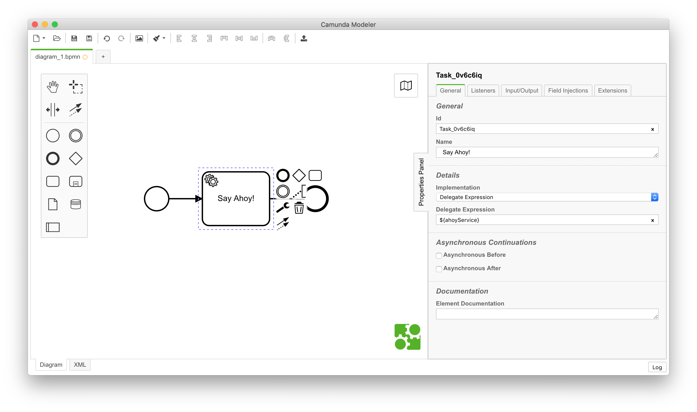

> Workshop 1 @ CamundaCon 2019

## Table of Contents
**Part I: Fundamentals**
* Step 0: [Adjust Dependencies](#step-0-adjust-dependencies)
* Step 1: [Connect to a Datasource](#step-1-connect-to-a-datasource)
* Step 2: [Generate the Uber-Jar & Start the Application](#step-2-generate-the-uber-jar--start-the-application)

**Part II: Advanced Topics**
* Step 1: [Ahoy, Shipmates!](#step-1-ahoy-shipmates)
* Step 2: [Setup Web Applications](#step-2-setup-web-applications)
* Step 3: [Customize the Look & Feel of Tasklist](#step-3-customize-the-look--feel-of-tasklist)
* Step 4: [Spring Boot Security](#step-4-spring-boot-security)

**Misc**
* [Intermediate Solutions](#intermediate-solutions)
* [Please Provide Feedback!](#please-provide-feedback)

## Part I: Fundamentals

### Step 0: Adjust Dependencies

After cloning the repository from GitHub, the basic project skeleton is already present.

> ⚠️ **Heads-Up!**
> 
> Before you continue with the next steps, please make sure to remove or comment out the following dependencies 
> from the `pom.xml` file since we need them only at a later step:

```xml
<!-- Spring Boot Web -->
<dependency>
  <groupId>org.springframework.boot</groupId>
  <artifactId>spring-boot-starter-web</artifactId>
</dependency>

<!-- Web Applications -->
<dependency>
  <groupId>org.camunda.bpm.springboot</groupId>
  <artifactId>camunda-bpm-spring-boot-starter-webapp</artifactId>
  <version>3.3.4</version>
</dependency>

<!-- Spring Security -->
<dependency>
  <groupId>org.springframework.boot</groupId>
  <artifactId>spring-boot-starter-security</artifactId>
</dependency>
```

### Step 1: Connect to a Datasource

Let's connect the application to a datasource.

1.  Start the postgres docker container:
    ```sh
    docker run -p 5432:5432 postgres
    ```
2. Create the file `src/main/resources/application.yaml`
3.  Add the following lines to the `application.yaml` file:
    ```yaml
    spring.datasource:
      type: org.postgresql.ds.PGSimpleDataSource
      username: postgres
      password: postgres
      url: jdbc:postgresql://localhost:5432/postgres
    ```

### Step 2: Generate the Uber-Jar & Start the Application

We now have a basic configuration of Camunda BPM's Workflow Engine connected to a PostgreSQL database & the REST API. 

Let's start the application for the first time and see if everything worked out.

1.  Generate the self-contained Uber-Jar by running the following command:
    ```sh
    mvn -o clean install
    ```
    When the build procedure has been successfully finished, you should see a similar output like this:
    ```
    ...
    [INFO] --- maven-install-plugin:2.4:install (default-install) @ spring-boot-workshop ---
    [INFO] Installing $HOME/spring-boot-workshop/target/spring-boot-workshop-0.0.1-SNAPSHOT.jar to $HOME/.m2/repository/com/camundacon/workshop/spring-boot-workshop/0.0.1-SNAPSHOT/spring-boot-workshop-0.0.1-SNAPSHOT.jar
    [INFO] Installing $HOME/spring-boot-workshop/pom.xml to $HOME/.m2/repository/com/camundacon/workshop/spring-boot-workshop/0.0.1-SNAPSHOT/spring-boot-workshop-0.0.1-SNAPSHOT.pom
    [INFO] ------------------------------------------------------------------------
    [INFO] BUILD SUCCESS
    [INFO] ------------------------------------------------------------------------
    [INFO] Total time:  2.579 s
    [INFO] Finished at: 2019-07-06T17:54:36+02:00
    [INFO] ------------------------------------------------------------------------
    ```
2.  Start the application:
    ```sh
    java -jar target/spring-boot-workshop-0.0.1-SNAPSHOT.jar
    ```
    Please watch out for the following lines since it means that the application has been started successfully:
    ```
     ____                                 _         ____  ____  __  __
    / ___| __ _ _ __ ___  _   _ _ __   __| | __ _  | __ )|  _ \|  \/  |
    | |   / _` | '_ ` _ \| | | | '_ \ / _` |/ _` | |  _ \| |_) | |\/| |
    | |__| (_| | | | | | | |_| | | | | (_| | (_| | | |_) |  __/| |  | |
    \____/\__,_|_| |_| |_|\__,_|_| |_|\__,_|\__,_| |____/|_|   |_|  |_|
    
      Spring-Boot:  (v2.1.6.RELEASE)
      Camunda BPM: (v7.11.0)
      Camunda BPM Spring Boot Starter: (v3.3.4)
    ...
    2019-07-06 17:55:01.359  INFO 25331 --- [main] c.c.workshop.MyApplication                    : Started MyApplication in 6.579 seconds (JVM running for 7.113)
    2019-07-06 17:55:01.364  INFO 25331 --- [main] org.camunda.bpm.engine.jobexecutor            : ENGINE-14014 Starting up the JobExecutor[org.camunda.bpm.engine.spring.components.jobexecutor.SpringJobExecutor].
    2019-07-06 17:55:01.367  INFO 25331 --- [ingJobExecutor]] org.camunda.bpm.engine.jobexecutor : ENGINE-14018 JobExecutor[org.camunda.bpm.engine.spring.components.jobexecutor.SpringJobExecutor] starting to acquire jobs
    ...
    ```
3.  Open the following link in your browser: [http://localhost:8080/rest/engine](http://localhost:8080/rest/engine). 
    You should see the following JSON array:
    ```json
    [{"name":"default"}]
    ```

**Congratulations!** The bootified Workflow Engine is now up and running. 🎉 🚀

## Part II: Advanced Topics

In this part we will focus on advanced topics revolving around Spring Boot and Camunda BPM.

### Step 1: Ahoy, Shipmates!

Let's model and deploy a simple workflow:

1.  Open the Camunda Modeler
2.  Create a new BPMN diagram
3.  Model a workflow with a Service Task that calls a java class with the help of a delegate 
    expression `${ahoyService}`
    
4.  Save the diagram under `src/main/resources/shipmates-workflow.bpmn`
5.  Create a java class `MyBeans.java` and place it under `src/main/java/com/camundacon/workshop/` with the following lines:
    ```java
    package com.camundacon.workshop;
    
    import org.camunda.bpm.engine.delegate.JavaDelegate;
    import org.springframework.context.annotation.Bean;
    import org.springframework.context.annotation.Configuration;
    
    @Configuration
    public class MyBeans {
    
      @Bean
      public JavaDelegate ahoyService() {
        return execution -> System.out.println("\n\nAhoy, " + execution.getVariable("myVariable") + "!");
      }
    
    }
    ```
6.  Rebuild the project and start the application:
    ```sh
    mvn -o clean install && java -jar target/spring-boot-workshop-0.0.1-SNAPSHOT.jar
    ```
7.  To review that the workflow was deployed successfully, open the following URL:
    [http://localhost:8080/rest/process-definition](http://localhost:8080/rest/process-definition) \
    Watch out for a similar JSON array:
    ```json
    [{"id":"Process_1sson0w:1:3dc0b03a-a0ba-11e9-b47d-c6bbb7c7e9e3","key":"Process_1sson0w","category":"http://bpmn.io/schema/bpmn","description":null,"name":null,"version":1,"resource":"my-workflow.bpmn","deploymentId":"3db0d1b8-a0ba-11e9-b47d-c6bbb7c7e9e3","diagram":null,"suspended":false,"tenantId":null,"versionTag":null,"historyTimeToLive":null,"startableInTasklist":true}]
    ```
8.  Now, we want to start a new instance of the workflow:
    1.  Add the following maven coordinates to the `pom.xml` file:
        ```xml
        <!-- Spring Boot Web -->
        <dependency>
          <groupId>org.springframework.boot</groupId>
          <artifactId>spring-boot-starter-web</artifactId>
        </dependency>
        ```
    2. Rebuild the project and start the application:
      ```sh
      mvn -o clean install && java -jar target/spring-boot-workshop-0.0.1-SNAPSHOT.jar
      ```
    3. Open the following URL in your browser: [http://localhost:8080/start-workflow.html](http://localhost:8080/start-workflow.html)
    4. Enter your process definition key and an arbitrary name
    5. Click on the "Start" button
9. Please check the output of your running application and look for a similar line `Ahoy, Shipmates!`

### Step 2: Setup Web Applications

In this section we will extend the Uber-Jar by adding the web applications and customizing Tasklist.

1.  To add the web applications, extend the `pom.xml` by adding the following maven coordinates to the dependencies section:
    ```xml
    <!-- Web Applications -->
    <dependency>
      <groupId>org.camunda.bpm.springboot</groupId>
      <artifactId>camunda-bpm-spring-boot-starter-webapp</artifactId>
      <version>3.3.4</version>
    </dependency>
    ```
2.  To create the admin user, add the following lines to the `application.yaml` file:
    ```yaml
    camunda.bpm.admin-user:
      id:       CaptainJack
      password: SecretPrey
    ```
3.  Rebuild the project and start the application:
    ```sh
    mvn -o clean install && java -jar target/spring-boot-workshop-0.0.1-SNAPSHOT.jar
    ```
4. Go to [http://localhost:8080/app/](http://localhost:8080/app/) to see if the web applications 
are present

You can now use the Webapps with your Admin User credentials:

**Username:** CaptainJack \
**Password:** SecretPrey

### Step 3: Customize the Look & Feel of Tasklist

In this section we will customize the Look & Feel of Tasklist by ...

* Replacing the logo with a cat
* Changing the colors

1.  Create the stylesheet `user-styles.css` (the correct file name matters!) and place it under 
    `src/main/resources/META-INF/resources/webjars/camunda/app/tasklist/styles`:
    ```css
    /* replaces the logo with a cat */
    .navbar-brand {
      text-indent: -999em;
      background-image: url(http://localhost:8080/cat.gif);
      background-position: center;
      background-size: 60%;
      background-repeat: no-repeat;
      width: 185px;
    }
    
    /* changes some colors */
    [cam-widget-header] {
      border-top: 3px solid blue;
    }
    
    .btn-primary {
      background-color: blue;
      border-color: blue;
    }
    ```
2.  Rebuild the project and start the application:
    ```sh
    mvn -o clean install && java -jar target/spring-boot-workshop-0.0.1-SNAPSHOT.jar
    ```
3.  Go to [http://localhost:8080/app/tasklist/](http://localhost:8080/app/tasklist/) to see the 
    result

### Step 4: Spring Boot Security

Right now, the REST API is not secured and unauthorized actions can be performed. Let's add Basic 
Auth with the help of Spring Boot Security.

1.  Add the following maven coordinates to the dependencies section of your `pom.xml` file:
    ```xml
    <!-- Spring Security -->
    <dependency>
      <groupId>org.springframework.boot</groupId>
      <artifactId>spring-boot-starter-security</artifactId>
    </dependency>
    ``` 
2.  Create the class `MyWebSecurityConfig` and place it under 
    `src/main/java/com/camundacon/workshop/` containing the following lines:
    ```java
    package com.camundacon.workshop;
    
    import org.springframework.context.annotation.Configuration;
    import org.springframework.security.config.annotation.web.builders.HttpSecurity;
    import org.springframework.security.config.annotation.web.configuration.EnableWebSecurity;
    import org.springframework.security.config.annotation.web.configuration.WebSecurityConfigurerAdapter;
    
    @Configuration
    @EnableWebSecurity
    public class MyWebSecurityConfig extends WebSecurityConfigurerAdapter {
    
      @Override
      protected void configure(HttpSecurity http) throws Exception {
        http
            .csrf()
            .disable()
            .authorizeRequests()
              .regexMatchers("/rest/(.*)")
                .authenticated()
            .and()
            .httpBasic();
      }
    
    }
    ```
3.  Choose a username and password and define it in the `application.yaml` configuration:
    ```yaml
    spring.security.user:
      name:     CaptainHook
      password: Rum
    ```
4.  Rebuild the project and start the application:
    ```sh
    mvn -o clean install && java -jar target/spring-boot-workshop-0.0.1-SNAPSHOT.jar
    ```
5. You can review the result by accessing the REST API 
   [http://localhost:8080/rest/engine](http://localhost:8080/rest/engine). You should see a modal
   dialog which prompts you to enter your credentials.

## Intermediate Solutions

Wanna catch up? Here you can download intermediate solutions:

* [Fundamentals (Step 0 to 2)](https://github.com/camundacon2019/uber-jar/archive/2-fundamentals.zip)
* Advanced Topics
    * [Ahoy, Shipmates! (Step 1)](https://github.com/camundacon2019/uber-jar/archive/3-ahoy.zip)
    * [Customizing Webapps (Step 2 & 3)](https://github.com/camundacon2019/uber-jar/archive/4-customizing.zip)
    * [Securing REST API (Step 4)](https://github.com/camundacon2019/uber-jar/archive/5-securing.zip)

## Please Provide Feedback!

We're running a survey about the workshop and would love your input (just 5 questions):

[https://www.surveymonkey.de/r/RY8Y3DF](https://www.surveymonkey.de/r/RY8Y3DF)

Thanks for participating!
